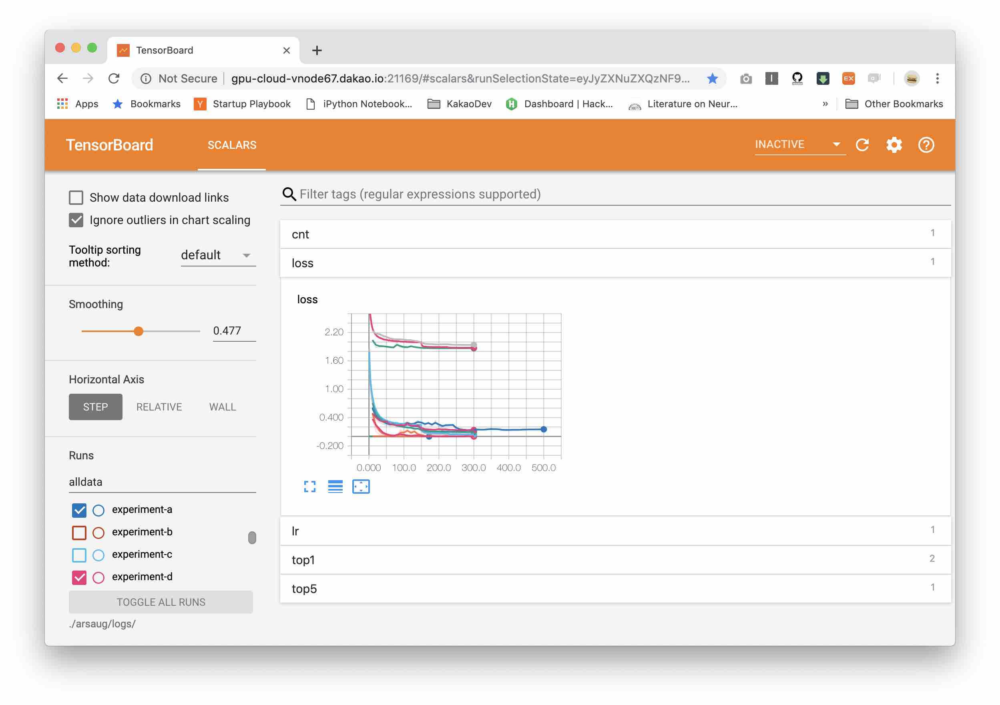

# tb-reader
TensorBoard Log Parser

## Support

- Scalar Graph

## Usage

### Install

#### Pip Install

```
$ pip install git+https://github.com/ildoonet/tbreader.git
```

#### Git Submodule

You can include this repo as a git submodule.

### Example



```
>>> from tbreader import get_lognames
>>>
>>> get_lognames('/data/private/cnn/logs')
['experiment-a', 'experiment-b', ...]
>>> parse_tags('/data/private/cnn/logs', 'experiment-a', 'loss')
[ScalarEvent(wall_time=1548748843.2184224, step=0, value=40.20000076293945), ScalarEvent(wall_time=1548749019.8741286, step=1, value=55.04999923706055), ...]
```

ScalarEvent have 3 attributes.
- wall_time
- step
- value (in this example, it is a loss value)

